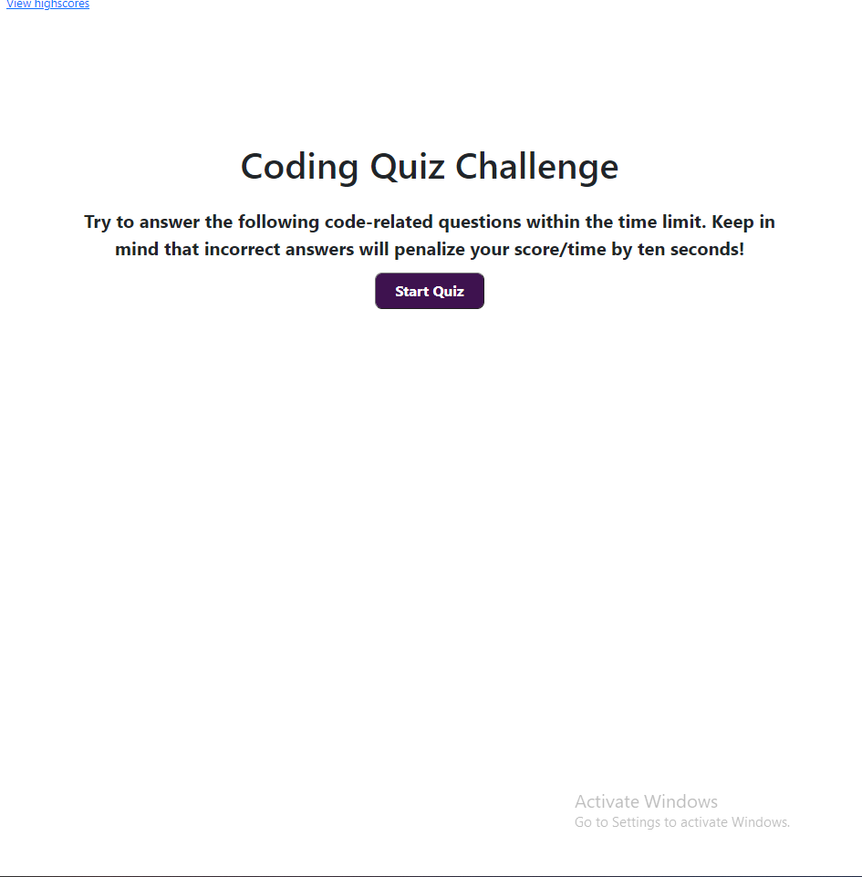
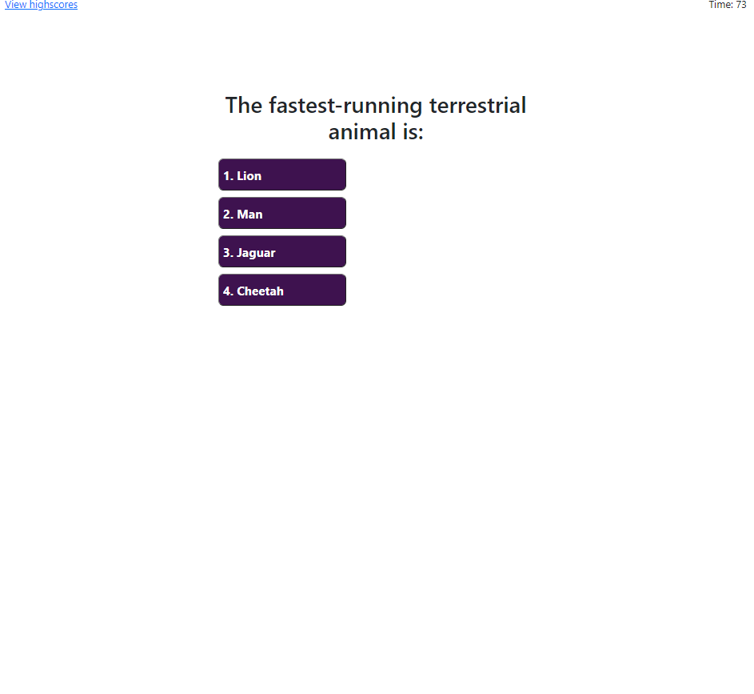
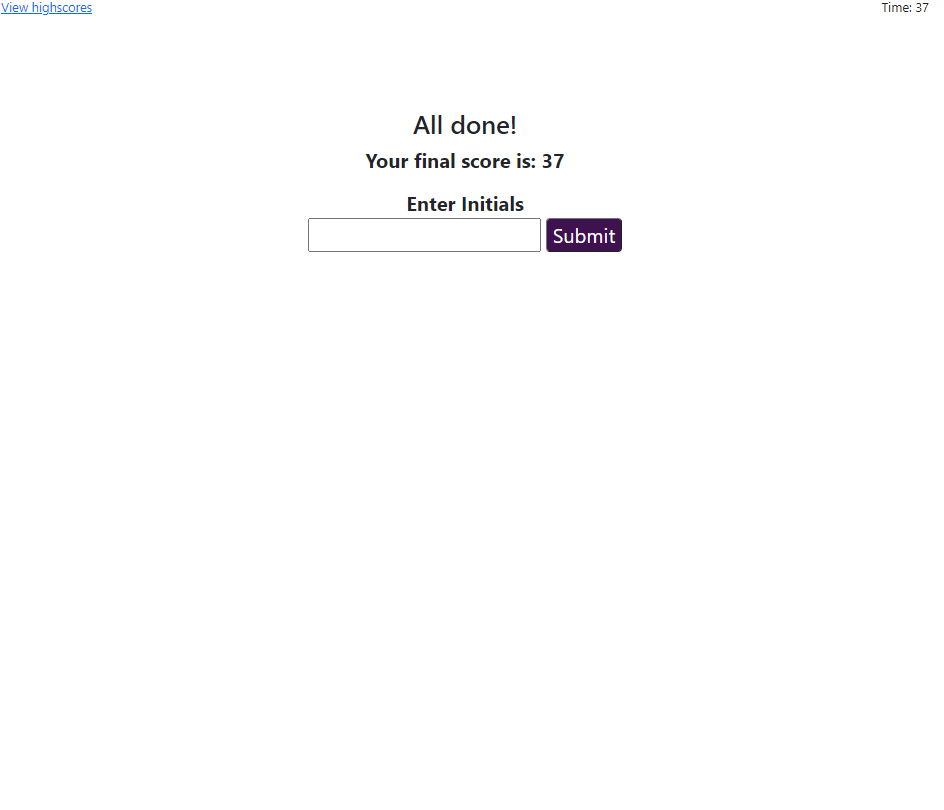
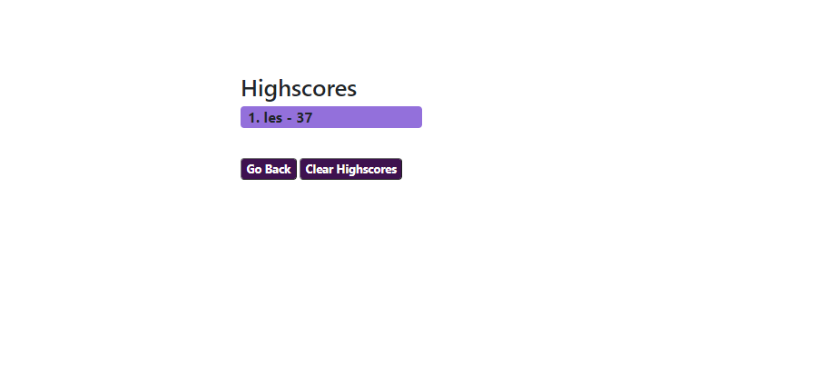

# Quiz-de-Luigi 

## Description
This project assigment is a Javascript Coding Quiz for SMU Coding Bootcamp.

It is a quiz that is initiated on the click of the start button, followed by a series of multiple choice questions.

## Usage

1. When you click on the **start button**, you will be presented with a multiple choice quiz.

2. Your time will be deducted by 10 seconds for every incorrect answer; your score is directly affected by this penalty.

3. After the series of questions, you will then be presented with a form asking for your initials along with presenting your final score.

4. You will then be redirected to **highscore.html** to view leaderboard history. You can also go directly to **highscore.html** from the start page.

### Link
If you would like to try it using this [link, ](https://wingz003.github.io/Quiz-de-Luigi/) you will understand where the real question is.
